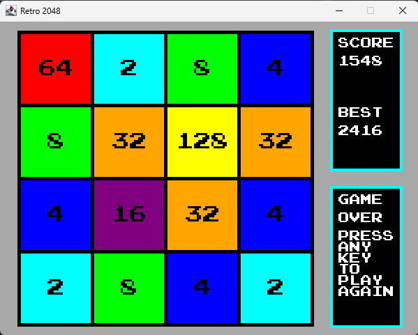

# Retro 2048

A retro-themed clone of [2048](https://play2048.co), the single-player sliding tile puzzle video game.

## Screenshot



## Usage

- Install **Java 8+** from [Java](https://www.java.com/en/download) or [Oracle](https://www.oracle.com/java/technologies/downloads); to check the version:
```bash
java -version
```
- Download [**Retro2048.jar**](Retro2048.jar)
- Run the JAR
    - Run from the terminal:
    ```bash
    java -jar Retro2048.jar
    ```
    - Double-click the JAR

## Features

- Classic 4×4 2048 gameplay
- WASD / arrow key controls
- Retro-themed UI
- Lightweight, no dependencies
- Runnable as a standalone JAR

## Tech Stack


## Credits

- [**2048**](https://github.com/gabrielecirulli/2048) - Developed by Gabriele Cirulli ([@gabrielecirulli](https://github.com/gabrielecirulli))
- [**Press Start 2P Font**](https://www.fontspace.com/press-start-2p-font-f11591) - Created by Cody "CodeMan38" Boisclair ([cody@zone38.net](mailto:cody@zone38.net))
